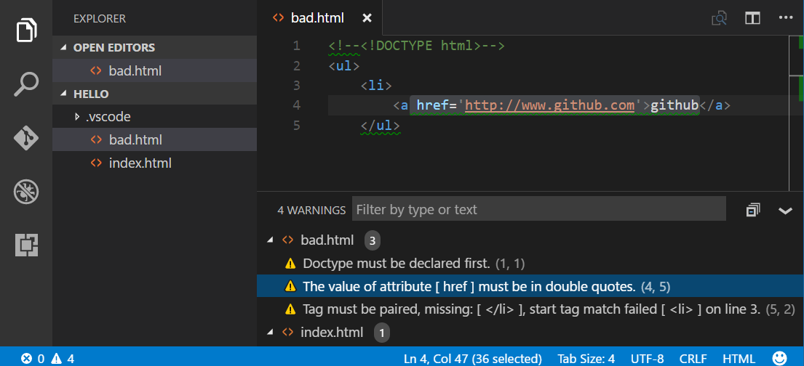

# vscode-htmlhint

Integrates the [HTMLHnt](https://github.com/yaniswang/HTMLHint) static analysis tool into Visual Studio Code.



## Configuration

The HTMLHint extension uses a bundled version of HTMLHint so no further configuration is required besides installing the extension.

## Usage

The HTMLHint extension will run HTMLHint on your open HTML files and report the number of errors on the Status Bar with details in the Problems panel (**View** > **Problems**).


Errors in HTML files are highlighted with squiggles and you can hover over the squiggles to see the error message.


>**Note:** HTMLHint will only analyze open HTML files and does not recurse through your project folder.

## Rules

The HTMLHint extension uses the default [rules](https://github.com/yaniswang/HTMLHint/wiki/Usage#about-rules) provided by HTMLHint.

```json
{
    "tagname-lowercase": true,
    "attr-lowercase": true,
    "attr-value-double-quotes": true,
    "doctype-first": true,
    "tag-pair": true,
    "spec-char-escape": true,
    "id-unique": true,
    "src-not-empty": true,
    "attr-no-duplication": true,
    "title-require": true
}
```

## .htmlhintrc

If you'd like to modify the rules, you can provide a `.htmlhintrc` file in the root of your project folder with a reduced ruleset or modified values.

You can learn more about rule configuration at the HTMLHint [Usage page](https://github.com/yaniswang/HTMLHint/wiki/Usage#cli).

## Settings

The HTMLHint extension provides two settings:

* `htmlhint.enable` - disable the HTMLHint extension globally or per workspace.
* `htmlhint.options` - provide rule set to override on disk `.htmlhintrc` or HTMLHint defaults.

For example:

```json
"htmlhint.options": {
    "tagname-lowercase": false,
    "attr-lowercase": true,
    "attr-value-double-quotes":  true,
    "doctype-first": true
}
```